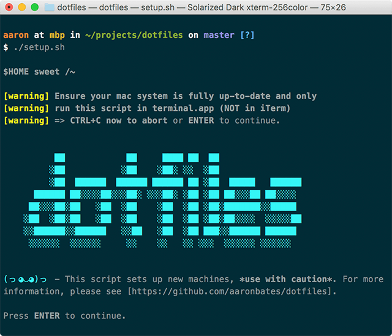

# `$HOME sweet ~/`

<!---[](http://forthebadge.com) [](http://forthebadge.com)--->

Your dotfiles are how you personalize your system.

These are mine. Built for Mac OS X. Certified lit :fire: :fire: :fire:

**Rationale**

Setting up a new developer machine can be **ad-hoc**, **manual**, and **time-consuming**. This project simplifies that process using easy-to-understand instructions, configuration and scripts.

> Our goal is to automate at least **80%** of any new macOS system setup.

## What's in the box?

Setup and config for bash, curl, git, node, ruby, tmux, vim, brew, apps, dev environments and more — there's a lot to list so please see the full [Package Contents](docs/package-contents.md).

### Highlights

- **Xcode Command Line Tools** with automated install.
- **Awesome bash setup**: [aliases](bash/.aliases), [functions](bash/.functions), [z](https://github.com/rupa/z), smart prompt, tab completion and more.
- **Git done right**: [aliases](git/.gitconfig), [hub](https://hub.github.com), [git-friendly](https://github.com/jamiew/git-friendly) and custom scripts.
- **tmux to the max** using [config](tmux/.tmux.conf) and shortcuts.
- **Vim for the win** via [vim-pathogen](https://github.com/tpope/vim-pathogen), [vim-sensible](https://github.com/tpope/vim-sensible) and other plugins.
- **Homebrew package manager** to install tools, applications and fonts.
- **Must-have tools**: GNU core utils, gnupg, [quick look plugins](https://github.com/sindresorhus/quick-look-plugins), [wifi-password](https://github.com/rauchg/wifi-password), etc.
- **Must-have apps**: Caffeine, Dropbox, Chrome, [Spectacle](https://www.spectacleapp.com), Spotify, etc.
- **Developer tools**: Python, Go, Yarn, Postgres, AWS CLI, Docker, Heroku, VMs, etc.
- **Developer apps**: iTerm2, Framer, Sketch, Slack, Sublime, etc.
- **Node development** using [n](https://github.com/tj/n) with global package installer.
- **Ruby development** using [rbenv](https://github.com/rbenv/rbenv) and [ruby-build](https://github.com/rbenv/ruby-build).
- **Goodies in [bin](bin)** including git and tmux tools.

Also, last but not least:

- **[Setup scripts](#setup)** to manage backup, install, config and symlinking (plus [migration](#migration)).
- **Mackup** to [backup and restore](#mackup-for-backup) app settings and personal files.
- **OS X defaults** geared towards developers.

Sounds good? Let's go.

## Install

*Note: If working on a fresh install I recommend reading my [Mac OS X Setup Guide](docs/macos-setup.md) first.*

### Using Git

Clone the repository wherever you prefer — I like to store the files in **`~/projects/dotfiles`** and then symlink that to `~/dotfiles` (see [Symlinks](#step-5-symlinks)).

```bash
$ git clone https://github.com/aaronbates/dotfiles.git    
```

## Structure

To keep the project organised all files are split into directories and grouped around topic areas:

- **`ack`** — ack config
- **`bash`** — bash specific config
- **`bin`** — various binaries, symlinked to `~/bin` and in `$PATH`
- **`curl`** — curl config
- **`editor`** — editor config
- **`git`** — git config, attributes and ignore files
- **`iterm2`** — iterm2 themes
- **`mackup`** — config to backup app settings and personal files
- **`.mackup`** — `.cfg` files for custom apps, symlinked to `~/.mackup`
- **`macos`** — macOS prefs
- **`node`** — node config
- **`ruby`** — ruby config
- **`screen`** — screen config
- **`setup`** — install, migrate and backup scripts
- **`shell`** — general shell config
- **`terminal`** — terminal themes
- **`tmux`** — tmux config
- **`vim`** — vim config
- **`wget`** — wget config
- **`/`** — project files and setup script

See [Extending](#extending) for information on adding new topics.

## Symlinks

[Symbolic links](https://en.wikipedia.org/wiki/Symbolic_link) (aka "symlinks") allow you to point one location on a system to another, be that a file or directory. They are similar to aliases and shortcuts, but more "powerful" in the context we'll be using them.

Most dotfiles need to live in the root of a user's directory (`~/`) for applications to find them.

Rather than copy files to `~/` or put my entire `$HOME` under [version control](https://en.wikipedia.org/wiki/Version_control), I prefer to symlink dotfiles to my user directory. This offers several benefits:

1. **I can edit files in one place** — changes apply to both my current system and this project's repo.
2. **My user directory is clean** — no git repo in `~/`, no mess, no need for a complex `.gitignore`.
3. **Symlinks are easy** — add, refresh and unlink using a config script.

OK, that's enough theory, let's get things set up.

## Setup

:warning: **Scripts in this project perform automated tasks. Review the code first and use at your own risk!** :warning:

This projects takes a light-weight approach to automation using a combination of **[Homebrew](https://brew.sh)**, **[Homebrew Cask](https://caskroom.github.io)**, and **shell scripts**.  To setup simply open Terminal then:

```bash
$ cd ~/projects/dotfiles # or wherever you cloned to.
$ ./setup.sh
```

The setup process will start and guide you through:



 You'll also be asked to enter your password once at the start — **if using on a fresh install, you'll have to restart after the first run applies system updates.**

### Step-by-step

Setup consists of six steps:

1. [**Backup** directories and files we'll be touching](#step-1-backup)
2. [Create required **directories**](#step-2-directories)
3. [Install **Xcode Command Line Tools**](#step-3-xcode-command-line-tools)
4. [Install **Homebrew** and all required apps](#step-4-homebrew)
5. [Create **symlinks** for directories and files](#step-5-symlinks)
6. [Final touches](#step-6-final-touches)

### Step 1: Backup

> This step runs the [`setup/backup.sh`](setup/backup.sh) script.

Creates `~/backup/dotfiles-backup` then takes a copy of all files on the current system which would be replaced by the setup script (as defined [here](docs/backup.md)) — it also backs up some other useful local directories and files.

### Step 2: Directories

> This step runs the [`setup/directories.sh`](setup/directories.sh) script.

Creates required and preferred directories (if they don't already exist) for example: `~/Applications`, `~/projects`, `~/code`, `.ssh/control`, etc.

### Step 3: Xcode Command Line Tools

> This step runs the [`setup/xcodecli.sh`](setup/xcodecli.sh) script.

The [Xcode Command Line Tools](https://developer.apple.com/library/content/technotes/tn2339/_index.html) contain tools required by this setup script, this step will:

1. Install the Xcode Command Line Tools
2. Configure the tools
3. Prompt for license agreement

### Step 4: Homebrew

> This step runs the [`setup/brew.sh`](setup/brew.sh) script.

Package managers make it easy to install, update and remove software The best package manager for OS X is [Homebrew](http://brew.sh) — this step installs Homebrew along with many useful formulae and apps:

1. Install Homebrew
2. Install [Core utils](docs/package-contents.md#core-utils)
3. Install [Other useful utils](docs/package-contents.md#other-useful-utils)
4. Install [Backup tools](docs/package-contents.md#backup-tools)
5. Install [Development tools](docs/package-contents.md#development-tools)
6. Install [Databases](docs/package-contents.md#databases)
7. Install [DevOps tools](docs/package-contents.md#devops-tools)
8. Install [Webfont tools](docs/package-contents.md#webfont-tools)
9. Install [Fonts](docs/package-contents.md#fonts)
10. Install [Applications](docs/package-contents.md#applications-installed-via-homebrew-cask)
11. Install [Quicklook plugins](docs/package-contents.md#quicklook-plugins)

The script then uses [`mas`](https://github.com/mas-cli/mas) to install some [Mac App Store applications](docs/package-contents.md#mac-app-store-applications) unavailable via Homebrew.

#### Node setup

Post application install the script [`setup/node.sh`](setup/node.sh) is run which:

1. Installs the latest Node release using [`n`](https://github.com/tj/n)
2. Installs the current LTS Node release using [`n`](https://github.com/tj/n)
3. Updates `npm`
4. Creates `~/.node-global-modules`
5. Installs [global modules](docs/package-contents.md#global-modules) to this folder

#### Vim setup

After this, the script [`setup/vim.sh`](setup/vim.sh) is run which:

1. Creates required vim directories
2. Installs [vim-pathogen](https://github.com/tpope/vim-pathogen)
3. Installs [plugins](docs/package-contents.md#vim)

### Step 5: Symlinks

> This step runs the [`setup/symlinks.sh`](setup/symlinks.sh) script.

Creates symlinks for all required directories and files to `~/`. These are defined in [`setup/files.sh`](setup/files.sh) as:

1. All directories declared in `$dotfilesdirarray`
2. Any file of an [accepted type](#which-files-will-be-symlinked) in a directory declared in `$dotfilesfilearray`
3. Custom manually declared files ([git-friendly](https://github.com/jamiew/git-friendly) scripts to `bin`)

This also links the local repository directory to `~/dotfiles` if it was cloned to a different location.

**Symlinking directories:** If directory `bin` is declared in `$dotfilesdirarray` then the whole directory will be symlinked to `~/bin`.

**Symlinking files:** If directory `bash` is declared in `$dotfilesfilearray` then any file of an [accepted type](#which-files-will-be-symlinked) will be symlinked to `~/`. For example:

- `bash/.aliases` links to `~/.aliases`
- `bash/.bash_profile` links to `~/.bash_profile`
- `bash/.functions` links to `~/.function`
- and so on.

#### Which files will be symlinked?

**Only files of type `.*`, `*.cfg` and `*.conf` will be symlinked.** Also, certain files are explicitly ignored:

- `.DS_Store`, `.git`, `.osx` and `.macos`
- any file of type `*.sh`

#### Symlink scripts

The symlink script can be run independently from a shell — it performs various checks, asks questions and provides feedback. Equally there is an [`setup/unlink.sh`](setup/unlink.sh) which unlinks all created symlinks.

### Step 6: Final touches

Finally a number of other tasks are performed:

- Install a [better .nanorc config](https://github.com/scopatz/nanorc)
- Set `chmod 700 ~/.ssh` and `chmod 600 ~/.ssh/*` (see [here](https://mediatemple.net/community/products/dv/204644740/using-ssh-keys-on-your-server))
- *Note: see [here](docs/getting-started.md#a-word-on-unix-style-permissions) for more info on Unix style permissions*
- Install Solarized Dark Theme for Terminal
- Install Solarized Dark High Contrast Theme for iTerm2

:zap: **Congrats, you now have an awesome macOS setup.** Open up iTerm2 and explore. :clap:

## Usage

It's beyond the scope of this readme to fully document all features, but you can find some tips and features of notes in the [Getting Started](docs/getting-started.md) guide.

## Customise using "local config"

This project can be easily customised to suit personal settings and local requirements using "local config" files. This allows you to:

- Use custom settings without forking this project.
- Set config you don’t want to commit to a public repo.
- Store credentials that should remain private.

As mentioned, it's **very** important to avoid storing private data or credentials in a dotfiles repository, using "local config" files that are never committed to public version control is a good way to achieve this.

*Note: if you plan to customise, install [Dotfiles Syntax Highlighting](https://github.com/mattbanks/dotfiles-syntax-highlighting-st2) for [Sublime](https://www.sublimetext.com) via [Package Control](http://wbond.net/sublime_packages/package_control).*

### Adding custom bash commands

If an `~/.extra` file exists, it will be sourced on load after all other bash files. You can use this to store custom aliases, functions, exports and settings.

**Example `~/.extra` file:**

```bash
alias myalias=some-other-command -options

my_function () {
  do something here
}

export MY_SETTING=VALUE
```

You could also use `~/.extra` to override *existing* settings, functions and aliases — but at that point, it's probably better just to [fork](#fork) and create your own dotfiles. :raised_hands:

### Customising your `$PATH`

The included [`.path`](bash/.path) file is pre-configured and sourced on load. To add custom entries to your path, create a `~/.path.local` file.

**Example `~/.path.local` file:**

```bash
# Add to the start of the path
PATH="/your/path/here:$PATH"

# Add to the end of the path
PATH="$PATH:/your/path/here"
```

This will also be sourced on load and the final `$PATH` will be deduplicated on export.

### Customising Git

Customise your Git config by creating a `~/.gitconfig.local` file which will extend [`.gitconfig`](git/.gitconfig). Use this to store private details such as your user credentials and signing key.

**Example `~/.gitconfig.local` file:**

```ini
[user]

  name = "Firstname Lastname"
  email = "your@emailaddress.com"

[github]

  user = your-github-username

[credential]

  helper = osxkeychain

[commit]

  signingkey = YOUR-SIGNING-KEY-HERE
```

### Customising Vim

Customise your Vim config by creating a `~/.vimrc.local` file which will extend [`.vimrc`](vim/.vimrc).

### Customising tmux

Customise your tmux config by creating a `~/.tmux.conf.local` file which will extend [`.tmux.conf`](tmux/.tmux.conf).

## Fork

**Feel free to fork this repo, hack around, and make it your own** :ok_hand:

### Extending

This project is organised around topics, see [Structure](#structure) for more information.

To add a new topic to your forked dotfiles, you can simply add a `/topic-name` directory and put any files in there. Let's use "Java" as an example:

1. Create a `java` directory in your dotfiles root.
2. Inside there, create two files: `java.conf` and `.javarc`

If you then edit [`setup/files.sh`](setup/files.sh) you have two options:

#### A) Symlink the entire folder

This will symlink the `java` directory to `~/java` (if that doesn't already exist). Useful if you want access to a number and variety of files within a directory.

To do this, simply add `"$dotfilesdir/java"` to the `dotfilesdirarray`:

```bash
# Declare array of directories we want to symlink.
declare -a dotfilesdirarray=(
  "$dotfilesdir/bin"
  ...  
  "$dotfilesdir/java"
)
```

Then run the [symlink script](#symlink-scripts) to apply the link.

#### B) Symlink *files* in the folder

This will symlink files of [accepted types](#which-files-will-be-symlinked) in the `java` directory to `~/` (if they don't exist already) — so for our example, it would create links to `~/java.conf` and `~/.javarc`.

To do this, add `"$dotfilesdir/java"` to the `dotfilesfilearray`:

```bash
# Declare array of directories we want to symlink files from.
declare -a dotfilesfilearray=(
  "$dotfilesdir/bash"
  "$dotfilesdir/git"
  ...
  "$dotfilesdir/java"
)
```

Then run the [symlink script](#symlink-scripts) to apply the links.

## Going further

### Sensible Mac OS X defaults

When setting up a new Mac, you may want to set some sensible defaults (as maintained by [Mathias](http://mths.be/macos)).

I have included my tweaked version of these settings in this repository, [take a look](macos/.macos) but :warning: **be very careful using this file** :warning: — I do *not* recommend just running it without reviewing and understanding it carefully first.

```bash
$ cd ~/dotfiles/macos && ./.macos
```

*If in any doubt, don't run this script, rather configure what you can manually.*

### Mackup for backup

[Mackup](https://github.com/lra/mackup) is a fantastic tool that allows you to: backup personal application settings and private data; sync that data between computers; and then easily restore your configuration to a fresh install — all in a simple command line interface. Seems good!

While by no means a comprehensive backup solution, Mackup keeps things simple, currently supports [over 360 applications](https://github.com/lra/mackup/mackup/applications) and can store data on Dropbox, Google Drive, iCloud or any path you can copy to.

#### How I use Mackup

I store on Dropbox and explicitly declare which apps to sync and which to ignore — anything handled by my dotfiles is ignored (bash, git, vim etc.)

I backup a wide range of other applications including those containing credentials such as aws, gnupg and ssh. I also backup apps not natively supported using custom `.cfg` files. For example, to backup [Ulysses](https://ulyssesapp.com) (an amazing markdown writing app) I created a `~/.mackup` directory and placed a `ulysses.cfg` file inside:

```ini
[application]
name = Ulysses

[configuration_files]
Library/Preferences/com.soulmen.ulysses3.plist
Library/Preferences/com.ulyssesapp.mac.plist
```

It is usually straight-forward to find which `.plist` files in `Library/Preferences` you'll need to list, they always feature the application name.

Taking that a step further we can also declare a "personal files" application using a `personal-files.cfg` and then cherry pick any other files we want to backup while keeping them out of a public repo:

```ini
[application]
name = Personal Files

[configuration_files]
.gitconfig.local
.extra
```

When I declare this in my main [`.mackup.cfg`](mackup/.mackup.cfg) they are handled with ease:

```ini
[storage]
engine = dropbox
directory = mackup

# Apps to sync — if empty, syncs all supported.
# custom: personal-files, break, grammarly, iconjar, iterm2, oversight, ulysses
[applications_to_sync]
personal-files
aws
...
ulysses
```

A simple `$ mackup backup` saves everything to Dropbox and I can later `$ mackup restore` on a fresh install to get these settings back (you can also easily `$ mackup uninstall`).

These dotfiles symlink my Mackup config into `~/` — take a look :eyes:.

### Migration

In addition to setup, it's possible to use these dotfiles on an configured Mac system to migrate to a new machine using the [`setup/migrate.sh`](setup/migrate.sh) script.

:warning: Caution is advised here — see the [Migration Guide](docs/migration.md) for more information.

## Acknowledgements

Credit, inspiration and thanks to:

- [Dev Setup](https://github.com/donnemartin/dev-setup)
- [Awesome Dotfiles](https://github.com/webpro/awesome-dotfiles)
- [Mathias](https://github.com/mathiasbynens/dotfiles)
- [Paul Irish](https://github.com/paulirish/dotfiles)
- [Holman](https://github.com/holman/dotfiles)
- [Mislav](https://github.com/mislav/dotfiles)
- [Springload](https://github.com/springload/dotfiles)

And too many others to name.

## License

[MIT](https://github.com/aaronbates/dotfiles/blob/master/LICENSE-MIT.txt) &copy; 2017 Aaron Bates ([http://aaronbates.me](http://aaronbates.me))

## TODO

- [ ] Link up Package Contents
- [ ] Install without Git
- [ ] Add BATS test suite
- [ ] Ruby config
- [ ] Databases config
- [ ] Devops config (VM, Docker)
- [ ] Consider additional [vim plugins](https://github.com/square/maximum-awesome)

----

:octocat: There's no place like `$HOME`.
<!--- — --->
